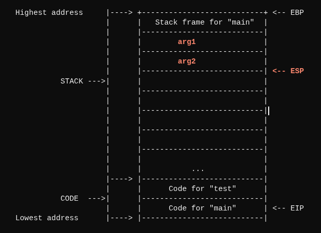

# 5. System enumeration (via shell)

### 5.1 Gaining a shell



We have to first identify the device name of the USB-UART adapter:

```shellscript
$ ls /dev | grep -i usb
ttyUSB0
```

&#x20;used `picocom` to retrieve a shell, with the baud rate as **115200** (a common first guess)

```shellscript
$ picocom -b 115200 /dev/ttyUSB0
```

* I received a log output with non-gibberish text
  * this means that the correct baud rate was chosen
* A "Hit enter to continue..." message was shown
  * From there, we are able to pop a **BusyBox v1.7.2 shell**

<figure><figcaption></figcaption></figure>

### 5.2 General enumeration

List of enumeration steps:

1. Read through the initial boot logs
2. Identify firmware version (to verify if the current version is still vulnerable)

* `nvram`&#x20;
* build date

3. Identify architecture
4. Identify `httpd` binary locations
5. ...


#### 5.2.1 Boot logs

```
CFE version 5.100.138.11 based on BBP 1.0.37 for BCM947XX (32bit,SP,LE)
Build Date: 11/23/11 12:16:38 CST (wzh@cybertan)
Copyright (C) 2000-2008 Broadcom Corporation.
```


#### 5.2.2 Firmware version

```shellscript
# firmware version
$ nvram get firmware_version
$ nvram show | grep -i version

# uname
$ uname -v
Wed Feb 15 20:33:15 CST 2012
```

* We have identified that the build date is **Feb 15 2012**

With the following simple Google dork:

```
site:downloads.linksys.com "e1200"
```

I managed to find details for a few release notes, with the earliest on **Aug 28, 2013**, and the latest on **Jan 5, 2018**

1. [https://downloads.linksys.com/downloads/866/465/E1200\_v2\_v2.2\_FwReleaseNotes,0.txt](https://downloads.linksys.com/downloads/866/465/E1200_v2_v2.2_FwReleaseNotes,0.txt)
2. [https://downloads.linksys.com/downloads/releasenotes/E1200\_v2\_v2.2\_FwReleaseNotes.txt](https://downloads.linksys.com/downloads/releasenotes/E1200_v2_v2.2_FwReleaseNotes.txt)

It is highly probable that the current firmware on the device has not been patched at all, and would most likely still be vulnerable to the CVEs we have discussed before.

#### 5.2.3 Further enumeration

```shellscript
# list all the available binaries

$ echo $PATH
/usr/bin:/bin:/usr/sbin:/sbin

$ ls /usr/bin
$ ls /bin
$ ls /usr/sbin
$ ls /sbin
```

```shellscript
# architecture
$ uname -u
$ cat /etc/version
$ cat /etc/banner
$ cat /etc/issue

 
# stack protections
$ cat /proc/cpuinfo
$ cat /proc/sys/kernel/randomize_va_space

```

### 5.3 `httpd` binary (CVE)

...

```shellscript
# common tools
$ which httpd
$ ps auxw | grep httpd
$ find / -type f -name '*httpd*' 2>/dev/null

# from /etc/inittab and /etc/init.d 
$ cat /etc/inittab
$ grep -R "httpd" /etc/init.d 2>/dev/null
```


