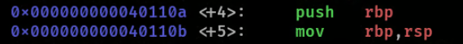

# x64 function call

We will understand the x64 function call convention with an example. General convention:

* arguments are loaded via registers (`rdi`, `rsi`, `rdx`, `rcx`, `r8`, `r9`)
* `rax` register will contain the function return value

We will use the following example functions:

* **main()** calls **add\_numbers()**
* **add\_numbers()** will not create any local variables, but instead reference offset to the local variable declared in **main()** . This will mean that **add\_numbers()** will:
  * **NOT** create a stack frame (`sub rsp, <VALUE>`)
  * **NOT** include the `leave` instruction (only `pop rbp`, without the instruction to restore the stack frame: `mov rsp, rbp`)

> Recall that `leave` is equivalent to: `mov rsp, rbp; pop rbp`

<figure><figcaption></figcaption></figure>

## Disassembly

<figure><figcaption></figcaption></figure>


<figure><figcaption></figcaption></figure>

### 1. main(): Load arguments (via registers)

Focus on instructions starting from line `0x401145`:

<figure><figcaption></figcaption></figure>

* The registers `esi`, `edx` (1st and 2nd arguments) are loaded with values taken as offset from current `rbp`&#x20;
  * this relates to address for values within the local stack frame for `main()` function -> `x` and `y`&#x20;

**Current memory state**

<figure><figcaption></figcaption></figure>

### 2. main(): `call` function

<figure><figcaption></figcaption></figure>

Equivalent to:


```asm
push 0x401154
jmp 0x401106
```


* `push` return address for when after `add_numbers()` returns
  * **0x401154**: this will be the address of the next instruction right after `call` &#x20;
* **0x401106** is the address of `add_numbers()` function

**Current memory state**

<figure><figcaption></figcaption></figure>

### 3. add\_numbers(): `push rbp; mov rbp, rsp`

<figure><figcaption></figcaption></figure>

* saves the current `rbp` value
* move `rsp` value into `rbp` to define the base of `add_numbers()` function stack frame

**Current memory state**

<figure><figcaption></figcaption></figure>

### 4. add\_numbers(): load arguments, add values, return result&#x20;

<figure><figcaption></figcaption></figure>

* `edi` and `esi` holds the value for the 1st and 2nd arguments to this function
* it will be moved into a particular offset from the `rbp`:
  * **rbp-0x14**
  * **rbp-0x18**

<figure><figcaption></figcaption></figure>

* values in these offsets will then be moved to `edx`  and `eax`

<figure><figcaption></figcaption></figure>

* **0x40111a**: add values in `eax` and `edx` and store in `eax`
* **0x40111c** and **0x40111f**: these instructions are actually redundant, since the result value is already stored in `eax` (return value register)

**Current memory state**

<figure><figcaption></figcaption></figure>

### 5. add\_numbers(): `pop rbp; ret`

<figure><figcaption></figcaption></figure>

* pop value current value on stack and restore to `rbp`&#x20;
* `ret` can be illstrustated as:


```asm
pop rax # contains 0x401154 ("rax" is just a placeholder register, it can actually be almost anything)
jmp rax
```


**Current memory state**

<figure><figcaption></figcaption></figure>

This will be the same state as before `main()` called the `add_numbers()` function

### 6. main(): Store return value (eax) to `rbp` offset

<figure><figcaption></figcaption></figure>

* return value (`result`  variable) can be accessed from the `eax`  register

### 7. main(): `leave; ret`

* `leave` can be illustrated as:


```asm
mov rsp, rbp
pop rbp
```


* `ret` can be illustrated as:


```asm
pop rax # contains address in function that called "main"
jmp rax
```

